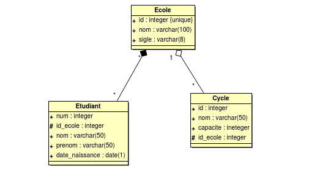

# Base de données

## Objectifs

* Savoir ce qu'est une base de données, un SGBD, un SGBDR, comment y sont représentées les données
* Connaître les principaux SGBD du marché
* Etre capable de modéliser un problème en utilisant le formalisme UML
* Savoir ce qu'est le language SQL et à quoi il sert

## Les bases de données

## Définitions (1/3)

* Qu'est ce qu'une base de données (BDD) ?

## Définitions (2/3)

* BDD = boîte qui contient des données ?
* Problèmes :
  * Un fichier texte est une BDD ?
  * Comment faire si le fichier contient énormément de données (plusieurs To) ?
  * Besoin d'outils pour de recherche, insertion, modification...

## Définitions (3/3)

> Une **base de données** est un ensemble de données qui sont stockées sur un support informatique, et structurées de manière à faciliter l'exploitation (ajout, mise à jour, recherche de données).
> Une **base de données** est une collection de données persistentes et pertinentes utilisées par des systèmes d'application de certaines organisations.

## Avantages d'utilisation d'une base de données par rapport à un système traditionnels (fichiers)

* **Compacité** : plus besoin de fichier manuel volumineux, fiche cartonnées ou le risque de perte d'informations est importants
* **rapidité** : recherche et mise à jour rapide d'information
* **données integrées** : regroupement de plusieurs fichiers de données ou toute redondance a été supprimé. D'où la diminution de l'incohérence.
* **données partagées** : Les différents utilisateurs peuvent faire usage de ces données pour des buts divers. ils peuvent également accéder aux mêmes données simultanément.

## Niveau de représentaion des données

Trois niveaux sont proposés pour l'architecture d'une base de données :

* le niveau conceptuel
* le niveau externe
* le niveau interne

### Le niveau conceptuel

Le schéma conceptuel est la « charpente » d'une base de données. Il décrit en termes abstraits la réalité organisationnelle et ses règles de gestion. En effet, ce schéma est le résultat du processus de conception qui consiste à traduire les objets du monde réel en classes d'objets suivant des modèles de données bien définis.

Il existe plusieurs types de modèles de données classés en trois catégories :

* Les modèles de 1ère génération (décennie 60) : Hiérarchique et Réseau
* Les modèles de 2ème génération (décennies 70 et 80) : E/A(Entités/Association), Relationnel...
* Les modèles de 3ème génération (décennie 90): Modèle orienté objet

### Le niveau externe

Un schéma externe appelé aussi Vue est une perception des données par un programme d'application. C'est un Sous-schéma du schéma conceptuel.
Il peut contenir des informations complémentaires (par exemple des informations de calcul).

### Le niveau interne

C'est le niveau relatif à la mémoire physique. Il concerne la manière selon laquelle les données sont réellement stockées, il correspond au schéma interne.

> **Remarque** :
Le processus de développement d'une BD comprend deux grandes phases :

* Une phase de conception dont le résultat est le schéma conceptuel. La validation s'effectue à travers les schémas externes
* Une phase de réalisation dont le résultat est le schéma interne et la base de données.

## SGBD

* **SGBD** : Système de Gestion de Base de Données

> Le SGBD est le logiciel destiné au stockage et à la manipulation de bases de données.
C'est le logiciel qui prend en charge tous les accès à la BD.

> Un système de gestion de base de données (SGBD) est un ensemble de programmes qui permet la gestion et l'accès à une base de données. Il héberge généralement plusieurs bases
de données, qui sont destinées à des logiciels ou des thématiques différentes.

## Objectifs d'un SGBD

Un SGBD dispose généralement d'un certains nombre d'objectifs

### 1 - Définition des données
  
permet de définir les données (schémas externes, schéma conceptuel, schéma interne et tous les liens correspondants) sous une forme non compilée et de les convertir dans la forme objet appropriée. Le SGBD doit donc être muni d'un langage de définition de données (LDD).

### 2 - Manipulation de données
  
Permet de traiter les requêtes de l'utilisateur pour interroger, modifier, supprimer ou insérer de nouvelles données.
Le SGBD doit être muni d'un langage de manipulation de données (LMD).

**Exemple**
SQL est un langage à la fois LDD et LMD

### 3 - Non redondance

Le schéma conceptuel de données constitue une représentation globale des informations selon un modèle de données. Par conséquent, la conception intégrée de la BD grâce à cette notion de schéma de données pour un ensemble d'applications, évite les redondances constatées dans les SGF.

### 4 - Cohérence

Les données de la BD obéissent à des règles appelées contraintes d'intégrité (CI).
Une CI est une assertion que doit vérifier le SGBD à chaque fois que la donnée sur laquelle elle est définie est sollicitée (déchargement de l'utilisateur lors des opération de création, modification, suppression).

### 5 -  Efficacité des accès aux données

Les accès aux données seront plus efficaces que dans les système de gestion de fichier grâce notamment :

* au développement d'index sophistiqués
* à l'existence de plusieurs chemins d'accès à une donnée
* à l'existence de techniques d'optimisation de requêtes qui sélectionnent le chemin optimal à une donnée.
  
### 6 - Administration centralisée

C'est le rôle de l'administrateur de la BD qui a pour fonction de :

* Définir des structures de stockage,
* Définir des structures de données,
* Assurer le suivi et le contrôle de leur évolution.

### 7 -  Indépendance physique

Permet à l'administrateur de la BD de modifier l'organisation physique des données (par ajout
d'index, par exemple) sans modification des programmes d'application déjà existants.

### 8 - Indépendance logique

permet de modifier le schéma conceptuel (ajouter de nouveaux attributs, de nouvelles classes d'objets,...) sans modifier les programmes d'applications.

### 9 -  Partageabilité

Le SGBD doit permettre à plusieurs applications de partager les données. Pour cela, il doit gérer les conflits d'accès (les détecter et les solutionner) . C'est le rôle du module de gestion des accès concurrents.

### 10 - Sécurité et confidentialité

Les données doivent être protégées contre les pannes et contre les accès mal intentionnés.

* Protection contre les pannes : On distingue deux types de pannes
  * Pannes simples caractérisées par la perte du contenu de la mémoire centrale
  * Pannes graves caractérisée par la perte du contenu des mémoires secondaires
  Dans les deux cas, il est possible de récupérer un état cohérent des données grâce à l'existence et à la gestion de journaux qui gardent la trace des exécutions antérieures.
* Protection contre les accès mal intentionnés : La définition de droits d'accès, de mots de passe... gérés par le SGBD permet d'assurer la confidentialité des données de la base.

**Exemple** :

* spécialité pour valeur ('IT', 'G', 'MASTER')
* une note est comprise entre 0 et 20

## Acteurs des SGBD

* Différents profils d'utilisateurs
  * Administrateur
  * Programmeur
  * Utilisateur avec outil informatique
  * Utilisateur sans outil informatique

## Notion de transation

> Une **transaction** est une séquence d'actions sur une base de données.

* Etat initial cohérent
* Etat final cohérent
* Contraintes d'intégrité

## Propriétés ACID

* 4 propriétés assurant la fiabilité des transactions :
  * Atomicité : une transaction est un ensemble d'instructions indivisibles
  * Cohérence : une transaction ne peut amener à violer une des contraintes de la base
  * Isolation : deux transactions concurrentes ne peuvent intéragir entre elles
  * Durabilité : si une panne survient pendant une transaction, l'ensemble de la transaction doit être annulée

## Ordonnancement des transactions

# Utilisation des SGBD

## Historique

* 1956 : premier disque dur
* 1964 : apparition du concept de base de données
* 1964 : moteur de base de données réseau IDS de General Electric
* 1966 : moteur de base de données hiérarchique IMS d'IBM
* 1970 : thèse de E. Codd introduisant le modèle relationnel
* 1974 : création du langage SQL
* 1974 : première version de INGRES
* 1975 : modèle entité-association
* 1977 : fondation de la société Oracle

## Aujourd'hui

* Multiplication des besoins et des données
  * base de données réparties (1989)
  * base de données orientées objets (1990)
  * NoSQL (1998)

## Utilisateurs de SGBD

* Banques
* Sites web marchands
* Réseaux sociaux
* Moteurs de recherche
* Producteurs de données
* ...

## Les marché des SGBD

# Modélisation des données

## Cycle de vie d'un SGBD

1. Conception
   * description du besoin => *modèle conceptuel*
2. Implémentation
   * traduction du modèle dans le SGBD => *modèle logique*
3. Utilisation
   * interrogations, mises à jours
4. Maintenance
   * corrections, évolutions

## Les différents types de modèles

* Hiérarchique : les données sont classées hiérarchiquement, selon une arborescence descendante. Ce modèle utilise des pointeurs entre les différents enregistrements. Il s'agit du premier modèle de SGBD.

* Réseau : comme le modèle hiérarchique ce modèle utilise des pointeurs vers des enregistrements. Toutefois la structure n'est plus forcément arborescente dans le sens descendant.

* Relationnel : Les données sont enregistrées dans des tableaux à deux dimensions (lignes et colonnes). La manipulation de ces données se fait selon la théorie mathématique des relations. 

* Orienté colonne

* Orientée document

* Graphe 

# Le modèle relationnel

## Généralités

* Créé par Codd en 1970
* Repose sur la théorie mathématique des ensembles
* Modèle le plus utilisé actuellement
* **SGBDR** = SGBD Relationnel
* Données de la base de données contenues dans des *relations*

## Exemples de SGBDR

## Les relations

> Une **relation**, ou *table*, est un ensemble de données relatives au même sujet.

* Sorte de contrat sur la forme attendue des données
* Relations représentées sour forme de tables : en-tête + lignes

## Les colonnes

> La **colonne** est le constituant de la relation.

* 1 colonne = 1 *nom* + 1 *domaine*
* **Domaine** : contrainte sur le contenu de la colonne
  * type (texte, nombre, etc.)
  * longueur (20 caractères, 32 bits, etc.)
  * règles (non nul, inférieur à 10, etc.)

## Exemple

* La relation VILLE contient trois colonnes nommées :
  * NOM
  * CODE_POSTAL
  * POPULATION
* La représentation classique de la relation est : 
  * VILLE(NOM, CODE_POSTAL, POPULATION)

## Exemple

* Le domaine de la colonne NOM est le suivant :
  * Type : texte
  * Longueur : 100 caractères
  * Les caractères autorisés sont les suivants : 0-9, a-z, A-Z, caractères accentuées, espace, "- / ' &"
  * Valeur nulle non autorisée
  * Pas de valeur par défaut

## Exemple

* Le domaine de la colonne CODE_POSTAL est le suivant :
  * Type : texte
  * Longueur : 5 caractères
  * Les deux premiers chiffres doivent correspondre à un numéro de département
  * Valeur nulle non autorisée
  * Pas de valeur par défaut

## Exemple

* Le domaine de la colonne POPULATION est le suivant :
  * Type : nombre entier
  * Longueur : 32 bits (*valeur max = 4 294 967 295*)
  * Valeur nulle par défaut

## Exemple

Table VILLE

| NOM              | CODE_POSTAL | POPULATION |
|:---------------- |:-----------:| ----------:|
| Paris            | 75000       | 2229621    |
| Champs-sur-Marne | 77420       | 24913      |
| Ajaccio          | 2A004       | 67507      |

## Les types de données dans PostgreSQL

<http://docs.postgresql.fr/9.2/datatype.html>

* Numériques (smallint, integer, bigint, decimal, numeric, real, double precision, serial)
* Monétaires
* Caractères : varchar, char, text
* Binaire
* Date/heure : date, heure, date-heure, intervalle (avec/sans fuseau horaire)
* Booleen : valeurs possibles TRUE, t, true, y, yes, on, 1 / FALSE, f, false, n, no, off,0
* Géométriques : point (16 octets), line (32o), lseg (32o), box (32o), path (16+16n o), polygon (40+16n o), circle (24o)
* Adresse réseau : IPv4, IPv6 et MAC. types cidr, inet (7 ou 9 octets) et macaddr (6 octets)
* Types composites : listes de types simples (*peu recommandés*) 

## Les liens entre relations

* Opérations possibles entre relations :
  * Union
  * Intersection
  * Différence
  * Produit cartésien
  * Sélection
  * Projection
  * Renommage
  * Jointure

## L'intersection

* Réunit dans une même relation les éléments communs des deux relations initiales

## L'union

* Réunit dans une relation les éléments qui sont dans les deux relations initiales

## La différence

* Réunit dans une relation les éléments d'une relation donnée qui ne se trouvent pas dans une autre

## Le produit cartésien

* Combine dans une relation les éléments de relations en entrée

## La sélection

* Sélectionne les éléments d'une relation répondant à une condition

## La projection

* Crée une nouvelle relation contenant l'ensemble des lignes d'une relation initiale, mais en ne conservant que certaines colonnes

## Le renommage

* Renomme une colonne dans une relation

## La jointure

* Composition des éléments de deux relations répondant à un critère de jointure

## Clés et liens entre relations (1/2)

> Une **clé primaire** est une colonne, ou un groupe de colonnes, permettant d'identifier de manière unique une ligne.
> 
> Une **clé étrangère** est utilisée pour lier des relations entre elles. Elle fait référence à une clé primaire d'une autre relation.

## Clés et liens entre relations (2/2)

* Différents types de liens possibles :

  * **1-1** : *un pays a une capitale, et une capitale est dans un seul pays*
  * **1-N** : *un pays possède plusieurs villes, mais une ville n'est que dans un seul pays*
  * **N-M** : *un pays possède des frontières et ces frontières concernent plusieurs pays*

* **Cardinalité** d'un lien

## Exercice

Exercice - clés primaire et étrangères

# UML

## Problématique

* Comment établir le modèle conceptuel d'une BDD relationnelle ?
  * outils ?
  * méthodologie ?
  * ... ?
* décrire une relation (*Relation(Colonne1, Colonne2...)*)
* décrire un domaine de manière textuelle (*Colonne1 est de type entier, la valeur doit être multiple de 3...*)
* le faire pour un ensemble de tables de manière concise

## Présentation d'UML (1/2)

* UML = Unified Modeling Language
* Utilisé pour tous les aspects de la conception de projets informatiques
* Langage graphique, normalisé, interprétable par un ordinateur

## Présentation d'UML (2/2)

* Actuellement en version 2
* 14 diagrammes :

## Diagramme de classe

* *Diagramme de base de données*
* Relation représentée sous forme d'un rectangle constitué de deux cases
* Nom de la relation dans la case du haut
* Liste des colonnes dans la case du bas
* Syntaxe pour une colonne : `nom_colonne: type(longueur)`
* Contraintes particulières sur une colonne ajoutées sous forme de notes

### Exemple

## Différents types de liens

* Lien simple
* Agrégation
* Composition

## Exercice

* Compagnie aériennes
* Association de randonneurs

# Le langage SQL

## Motivations / Problématique
