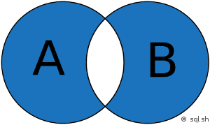

# Jointure SQL

Les
 jointures en SQL permettent d’associer plusieurs tables dans une même 
requête. Cela permet d’exploiter la puissance des bases de données 
relationnelles pour obtenir des résultats qui combinent les données de 
plusieurs tables de manière efficace.

## Exemple

En général, 
les jointures consistent à associer des lignes de 2 tables en associant 
l’égalité des valeurs d’une colonne d’une première table par rapport à 
la valeur d’une colonne d’une seconde table. Imaginons qu’une base de 2 
données possède une table “utilisateur” et une autre table “adresse” qui
 contient les adresses de ces utilisateurs. Avec une jointure, il est 
possible d’obtenir les données de l’utilisateur et de son adresse en une
 seule requête.

On peut aussi imaginer qu’un site web possède une 
table pour les articles (titre, contenu, date de publication …) et une 
autre pour les rédacteurs (nom, date d’inscription, date de naissance 
…). Avec une jointure il est possible d’effectuer une seule recherche 
pour afficher un article et le nom du rédacteur. Cela évite d’avoir à 
afficher le nom du rédacteur dans la table “article”.

Il y a 
d’autres cas de jointures, incluant des jointures sur la même table ou 
des jointure d’inégalité. Ces cas étant assez particulier et pas si 
simple à comprendre, ils ne seront pas élaboré sur cette page.

## Types de jointures

Il y a plusieurs méthodes pour associer 2 tables ensemble. Voici la liste des différentes techniques qui sont utilisées :

- **INNER JOIN:** jointure
   interne pour retourner les enregistrements quand la condition est vrai 
  dans les 2 tables. C’est l’une des jointures les plus communes.
- **CROSS JOIN:** jointure
   croisée permettant de faire le produit cartésien de 2 tables. En 
  d’autres mots, permet de joindre chaque lignes d’une table avec chaque 
  lignes d’une seconde table. Attention, le nombre de résultats est en 
  général très élevé.
- **LEFT JOIN:** jointure
   externe pour retourner tous les enregistrements de la table de gauche 
  (LEFT = gauche) même si la condition n’est pas vérifié dans l’autre 
  table.
- **RIGHT JOIN :** jointure
   externe pour retourner tous les enregistrements de la table de droite 
  (RIGHT = droite) même si la condition n’est pas vérifié dans l’autre 
  table.
- **FULL JOIN :** jointure externe pour retourner les résultats quand la condition est vrai dans au moins une des 2 tables.
- **SELF JOIN :** permet d’effectuer une jointure d’une table avec elle-même comme si c’était une autre table.
- **NATURAL JOIN :** jointure naturelle entre 2 tables s’il y a au moins une colonne qui porte le même nom entre les 2 tables SQL
- **UNION JOIN :** jointure d’union

## Exemples de jointures

### INNER JOIN


```sql
SELECT *
FROM A
INNER JOIN B ON A.key = B.key
```

### LEFT JOIN


```sql
SELECT *
FROM A
LEFT JOIN B ON A.key = B.key
```

### LEFT JOIN (sans l’intersection de B)


```sql
SELECT *
FROM A
LEFT JOIN B ON A.key = B.key
WHERE B.key IS NULL
```

### RIGHT JOIN


```
SELECT *
FROM A
RIGHT JOIN B ON A.key = B.key
```

### RIGHT JOIN (sans l’intersection de A)


```sql
SELECT *
FROM A
RIGHT JOIN B ON A.key = B.key
WHERE B.key IS NULL
```

### FULL JOIN


```sql
SELECT *
FROM A
FULL JOIN B ON A.key = B.key
```

### FULL JOIN (sans intersection)




```sql
SELECT *
FROM A
FULL JOIN B ON A.key = B.key
WHERE A.key IS NULL
OR B.key IS NULL
```
